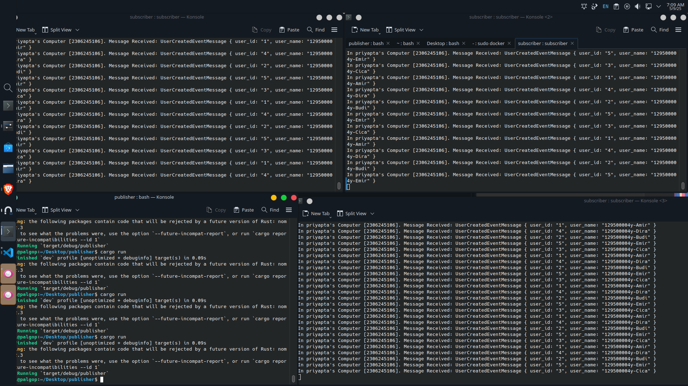
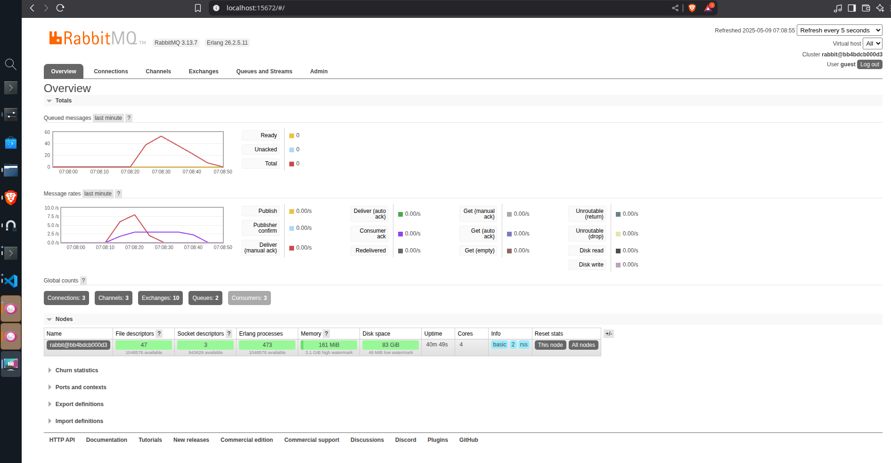

# A
1. What is amqp?
- Merupakan sebuah protocol yang digunakan untuk menghubungkan ke RabbitMQ server untuk dijalankan di local 
2. What does it mean? guest:guest@localhost:5672 , what is the first guest, and what
is the second guest, and what is localhost:5672 is for?
Untuk `guest:guest` merupakan username dan password  dan untuk `localhost:5762` untuk menghubungkan ke server local atau ke local machine

## Simulation Slow Subscriber

Jika dilihat dari chart RabbitMQ diatas, Queued messages mencapai hingga 75, Ini terjadi karena saya melakukan perintah cargo run pada publisher sebanyak 4 kali. Karena publisher mengirim data 5 sekaligus dan saya mengirim data sebanyak 16 kali, maka dengan adanya thread::sleep(ten_millis); maka akan ada (16-1) * 5 data message yang queued.

## Simulate Many Subcriber

- Grafik pada RabbitMQ menunjukkan terjadinya burst pada proses publish dari publisher, sementara beberapa subscriber mulai mengonsumsi pesan hampir secara bersamaan. Publisher mengirim pesan lebih cepat dibandingkan kemampuan subscriber dalam memprosesnya, sehingga antrean sempat menumpuk. Namun, antrean kembali menurun karena subscriber memproses pesan secara bertahap, meskipun terdapat delay sleep(1000ms).

Beberapa perbaikan yang dapat diterapkan pada kode publisher dan subscriber antara lain penggunaan method get_handler_action untuk mencegah panic, serta pengurangan duplikasi kode pada publisher dengan memanfaatkan loop.

