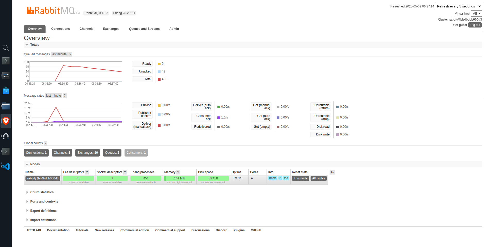

# A
1. What is amqp?
- Merupakan sebuah protocol yang digunakan untuk menghubungkan ke RabbitMQ server untuk dijalankan di local 
2. What does it mean? guest:guest@localhost:5672 , what is the first guest, and what
is the second guest, and what is localhost:5672 is for?
Untuk `guest:guest` merupakan username dan password  dan untuk `localhost:5762` untuk menghubungkan ke server local atau ke local machine

Simulation Slow Subscriber
